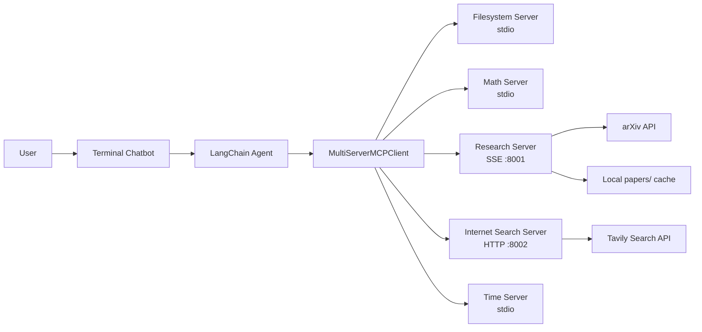

<h1 align="center">
  
  <br>
  Build Multi-Tool AI Agents with <span style="color:#0f766e;">MCP</span> + <span style="color:#2563eb;">LangChain</span>
</h1>

<h3 align="center">A practical learning project for connecting a LangChain agent to multiple MCP servers using stdio, SSE, and streamable HTTP.</h3>

<p align="center">
  
  
  
  
  
  
</p>

<p align="center">
  <a href="#-why-this-project-matters">Why this project matters</a> •
  <a href="#-architecture">Architecture</a> •
  <a href="#-quick-start">Quick Start</a> •
  <a href="#-how-it-works">How It Works</a> •
  <a href="#-available-mcp-servers">MCP Servers</a>
</p>

---

## Overview

This repository demonstrates how to build a real **MCP-powered AI chatbot** with **LangChain**.

Instead of giving your LLM a single tool, this project shows how to:

- connect a LangChain agent to **multiple MCP servers**
- mix **different transports** in one system
- expose your own tools using **FastMCP**
- combine **local tools**, **web search**, **research paper retrieval**, and **time utilities**
- maintain a simple **multi-turn chatbot loop** with message history

If you want to understand how **Model Context Protocol (MCP)** fits into a real Python project, this repo gives a clean, practical starting point.

---

## Why This Project Matters

Many MCP examples are small and isolated. This project is more useful for learning because it shows a complete flow:

- `LangChain agent` decides when to use tools
- `MultiServerMCPClient` loads tools from several MCP servers
- `FastMCP servers` expose custom capabilities
- `Anthropic / Groq models` can be swapped in as the reasoning engine
- `papers/` stores research outputs locally so the agent can revisit them later

This means you are not just learning MCP theory. You are learning how to wire it into an actual **agentic application**.

---

## Features

- `🧠` LangChain agent with MCP tools
- `🧰` Multi-server MCP client configuration
- `➕` Local custom math MCP server
- `📚` arXiv research paper search + extraction server
- `🌐` Tavily-powered internet search MCP server
- `🕒` Time server integration
- `📁` Filesystem MCP server support
- `💬` Interactive terminal chatbot loop
- `🔁` Support for multiple MCP transports in one project

---

## Architecture



### Flow Summary

1. The user asks a question in the terminal chatbot.
2. LangChain passes the conversation to the model.
3. The model decides whether a tool is needed.
4. MCP tools are discovered through `MultiServerMCPClient`.
5. The selected MCP server executes the tool call.
6. Results come back to the agent, and the final answer is returned to the user.

---

## Project Structure

```text
17. MCP/
├── chatbot/
│   └── chatbot.py              # Chat loop and message history
├── mcp_servers/
│   ├── server_config.py        # Multi-server MCP configuration
│   ├── math_server.py          # Local FastMCP math server
│   ├── research_paper.py       # arXiv-backed research server
│   └── internet_search.py      # Tavily-backed web search server
├── prompts/
│   └── system_prompt.py        # System prompt for the agent
├── papers/                     # Saved paper metadata by topic
├── notebooks/
│   └── test.ipynb              # Experiments / testing
├── main.py                     # Main entry point
├── requirements.txt
├── pyproject.toml
└── README.md
```

---

## Available MCP Servers

### `1. Filesystem Server`

- Runs via the official MCP filesystem server package
- Configured with `stdio`
- Lets the agent work with files in a target directory

### `2. Math Server`

Custom FastMCP server with:

- `add(a, b)`
- `sub(a, b)`
- `mul(a, b)`
- `div(a, b)`

Transport:

- `stdio`

### `3. Research Paper Server`

Custom FastMCP server powered by `arxiv` with:

- `search_papers(topic, max_results)`
- `extract_info(paper_id)`
- `papers://folders` resource
- `papers://{topic}` resource

Transport:

- `SSE`

What it does:

- searches arXiv
- stores paper metadata in `papers/<topic>/papers_info.json`
- allows later retrieval of saved paper details

### `4. Internet Search Server`

Custom FastMCP server powered by `Tavily` with:

- `search_internet(query, max_results)`

Transport:

- `streamable-http`

### `5. Time Server`

- Uses `mcp_server_time`
- Helpful for time-aware tool calling
- Configured with `stdio`

---

## Tech Stack

| Layer | Technology |
|------|------------|
| Agent Framework | LangChain |
| MCP Client | `langchain-mcp-adapters` |
| MCP Server Framework | FastMCP |
| LLMs | Anthropic Claude / Groq |
| Research Search | arXiv |
| Internet Search | Tavily |
| Env Management | python-dotenv |
| Runtime | Python 3.12+ |

---

## Quick Start

### `1. Clone the repository`

```bash
git clone <your-repo-url>
cd "17. MCP"
```

### `2. Create a virtual environment`

```bash
python -m venv .venv
```

Windows:

```bash
.venv\Scripts\activate
```

Linux / macOS:

```bash
source .venv/bin/activate
```

### `3. Install dependencies`

Using `pip`:

```bash
pip install -r requirements.txt
```

Or using `uv`:

```bash
uv sync
```

### `4. Configure environment variables`

Create a `.env` file with the required keys:

```env
TAVILY_API_KEY=your_tavily_key
GROQ_API_KEY=your_groq_key
ANTHROPIC_API_KEY=your_anthropic_key

LANGSMITH_TRACING=true
LANGSMITH_ENDPOINT=https://api.smith.langchain.com
LANGSMITH_API_KEY=your_langsmith_key
LANGSMITH_PROJECT=your_project_name
```

### `5. Update your filesystem MCP path`

Edit `mcp_servers/server_config.py` and change the filesystem root path to a directory that exists on your machine.

Current example:

```python
r"D:\Learnings"
```

### `6. Start the MCP servers`

Open separate terminals for the networked servers:

Research server:

```bash
uv run mcp_servers/research_paper.py
```

Internet search server:

```bash
uv run mcp_servers/internet_search.py
```

The other servers are started through configuration:

- filesystem server via `npx`
- math server via `uv run`
- time server via `python -m mcp_server_time`

### `7. Run the chatbot`

```bash
uv run main.py
```

You should see something similar to:

```text
Available Tools: ['add', 'sub', 'mul', 'div', 'search_papers', 'extract_info', 'search_internet', ...]

MCP Chatbot Started!
Type your queries or 'quit' to exit.
```

---

## How It Works

### `main.py`

This is the entry point of the application.

It does four key things:

1. loads environment variables
2. creates a `MultiServerMCPClient`
3. fetches tools from all configured MCP servers
4. builds a LangChain agent and starts the chatbot loop

### `server_config.py`

This file is the heart of the MCP integration.

It defines how each MCP server is connected:

- by `command` + `args` for `stdio`
- by `url` for `SSE` and `HTTP`

This is the file to study if you want to understand how **multiple MCP servers are orchestrated together**.

### `chatbot/chatbot.py`

This file manages:

- message history
- async agent calls
- terminal interaction loop

It keeps the app simple and easy to extend.

---

## Example Questions to Try

Once the servers are running, try prompts like:

- `What is 125 * 48 + 320?`
- `Search papers about retrieval augmented generation`
- `Give me the details of paper 2103.03874v2`
- `Search the internet for the latest news about MCP`
- `What time is it in Tokyo?`
- `Find papers about transformers and summarize the top results`

---

## Learning Outcomes

By studying this project, you will understand:

- how MCP differs from normal direct Python tool calling
- how to connect **LangChain** with **multiple MCP servers**
- when to use `stdio`, `SSE`, and `HTTP` transports
- how to create your own FastMCP tools
- how to persist tool outputs for reuse
- how to structure an MCP-based chatbot application

---

## Why MCP + LangChain Is Powerful

`MCP` gives your tools a standard protocol.

`LangChain` gives your LLM agent orchestration.

Together, they let you build systems where:

- tools are modular
- servers are replaceable
- models are swappable
- the agent can scale beyond one local script

That is the real value of this project: it teaches you how to move from a simple chatbot to a more extensible **tool ecosystem**.

---

## Current Notes

- The project currently uses `ChatAnthropic` in `main.py`, while a `ChatGroq` example is also included but commented out.
- The system prompt is intentionally minimal, which makes this a good learning base for experimenting with better agent instructions.
- The research server stores topic-based paper data under `papers/`.
- The internet and research servers must be running before the agent can use them.

---

## Possible Improvements

If you want to grow this project further, good next steps are:

- add streaming responses
- improve the system prompt for better tool selection
- add tool error handling and retries
- containerize the MCP servers
- add unit tests for each server
- add a web UI with Streamlit or FastAPI frontend
- support more research sources beyond arXiv

---

## Star This Repo If You Want More Projects Like This

If this project helped you understand **MCP with LangChain**, consider giving it a star.

It helps more developers discover practical MCP examples, and it encourages more real-world educational repos around agent tooling.

---

## Author

**Duwarahavidyan Jeganathan**

- GitHub: [@JDuwarahavidyan](https://github.com/JDuwarahavidyan)

---

## Final Thought

> Learn MCP by building with it.
>
> This project is a strong starting point for anyone who wants to go from "What is MCP?" to "I can build an MCP-powered agent myself."

<p align="center">
  
  
  
</p>
